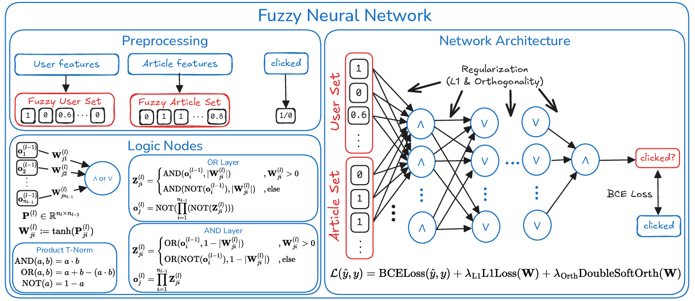

# News Recommender



## Project Structure

- `configs/`: The model configurations used in the experiments.
- `datasets/`: The datasets used in the experiments. Place the downloaded datasets as described below.
- `results/`: The results of the experiments will be saved here.
- `scripts/`: The scripts used to run the experiments.
- `scripts/baselines/`: The implementations of the baseline models.
- `src/`: The source code for the models.
- `main.py`: The main entry point for training and evaluating the models.
- `pyproject.toml`: The project configuration file.


## Setup

1. Install [uv](https://docs.astral.sh/uv/getting-started/installation/)
2. Download the dataset from [here](https://recsys.eb.dk/). Requires you to accept the license. We use `ebnerd_small (80MB)`.
3. Download the MIND dataset from [here](https://msnews.github.io/). Requires you to accept the license. We use **`MIND-small`**.


#### Datasets

Create a `datasets` folder and place the datasets in there. The folder structure should look like this:

```
<project-root>/
├── datasets/
│   ├── ebnerd_small/
│   │   ├── articles.parquet
│   │   ├── train/
│   │   │   ├── behaviors.parquet
│   │   ├── val/
│   │   │   ├── behaviors.parquet
│   ├── mind_small/
│   │   ├── train/
│   │   │   ├── behaviors.tsv
│   │   │   ├── news.tsv
│   │   │   ├── ...
│   │   ├── valid/
│   │   │   ├── behaviors.tsv
│   │   │   ├── news.tsv
│   │   │   ├── ...
```

## Running Experiments

The experiment scripts are located in the `scripts/` directory as bash scripts.

1. `all_experiments.sh`: Runs all experiments (EB-NeRD, MIND, ablation study, sensitivity analysis and baselines).
2. `ebnerd_experiment.sh`: Runs the EB-NeRD experiments.
3. `mind_experiment.sh`: Runs the MIND experiments.
4. `ablation_study.sh`: Runs the ablation study experiments.
5. `sensitivity_analysis.sh`: Runs the sensitivity analysis experiments. Takes multiple hours.
6. `baselines.sh`: Runs the baseline experiments.

